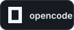
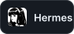
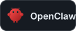
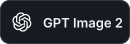
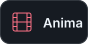
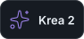
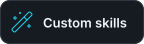

### 👋 Hi, I'm KISA — aka `howdeploy`

**Vibe coder, writer, content creator, and professional chat instigator.**

I build agent tools, creative workflows, and strange little systems where AI gets access to real devices.

**Vibe-coded software. Human-written words.**

<pre>
🤖 Vibe coding • AI agents • automation
⌨️ Codex • Kimi CLI • custom skills
🎨 GPT Image 2 • Anima • Krea 2
🐧 Linux • Flipper Zero • moddable gadgets
🎮 Gameplay-first games • keyboards • typing
</pre>

 

### 🧰 Tools I actually use

#### ⚡ Daily drivers

  
  

Codex and Kimi CLI — where most of the actual work happens.

#### 🧠 Agent stack

  
  
  
  
  

Coding agents, orchestration, automation, and experiments with tools that can act.

#### 🎨 Creative stack

  
  
  
  

Images, motion, and custom design workflows built around my own skills.

#### 🔧 Systems & hardware

  
  

Linux every day; moddable devices whenever possible.

### 🌤️ Outside the terminal

I'm into gameplay-first single-player and indie games, moddable gadgets, mechanical keyboards, Chinese anime trading cards, and the pure joy of typing.

🇷🇺 Native Russian speaker. English when necessary. Still waiting for neuralese.

  

  
  
  
  

